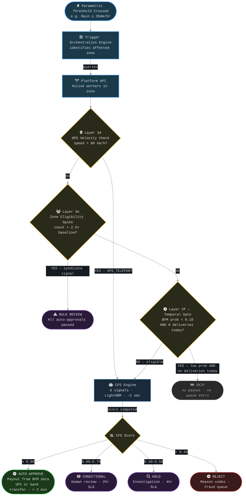
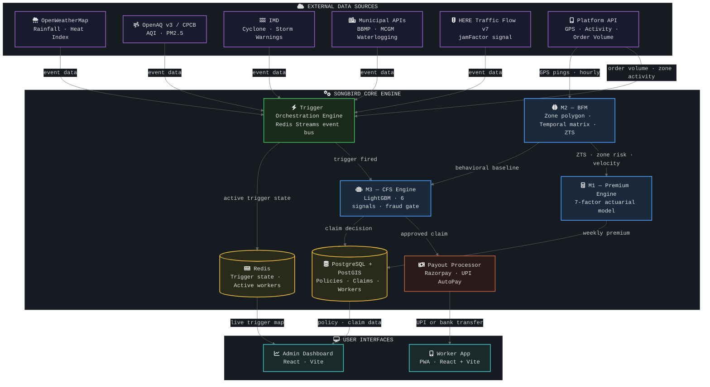

# SongBird — AI-Powered Parametric Income Insurance for Q-Commerce Delivery Partners

> **Hackathon Phase 1 Submission | March 2026**
> Protecting India's gig workers from income loss caused by weather, pollution, and social disruptions — with zero-touch claims and instant payouts.

---

## The Problem

India's Q-Commerce delivery partners (Zepto, Blinkit, Swiggy Instamart) are the backbone of the ₹64,000+ crore quick commerce industry (FY25, CareEdge). But when a monsoon hits, an AQI spike grounds operations, or a curfew locks down a zone — these workers bear the full financial loss alone.

- **20–30% of monthly income** can vanish in a single disruption event
- **150,000–250,000 workers per metro city** have zero income protection
- No existing insurance product covers parametric income loss for gig workers in India
- ESIC covers formal employees; gig workers remain outside any functioning safety net — the Code on Social Security (November 2025) granted legal recognition but benefit delivery, eligibility rules, and scheme notifications are still pending as of March 2026

We are building the safety net.

---

## Why Q-Commerce (Not Food or E-Commerce)

| Dimension | Food (Zomato/Swiggy) | E-Commerce (Amazon/Flipkart) | **Q-Commerce (Zepto/Blinkit)** |
|---|---|---|---|
| Delivery Radius | 5–8 km | 15–50 km | **1.5–3 km** |
| Disruption → Income Loss Lag | 20–30 min | Hours | **< 5 min** |
| Income Volatility from Events | Medium | Low | **Very High** |
| Parametric Trigger Precision | Medium | Low | **High** |

The 1.5–3 km dark store bubble makes Q-Commerce the ideal actuarial sandbox. A localized weather event creates near-binary income loss — the worker is either operational or completely halted. This eliminates the fuzzy "partial disruption" problem that plagues food delivery models.

> Note: Blinkit, Zepto, and Swiggy Instamart dropped the "10-minute delivery" branding in January 2026 following Union Labour Minister Mansukh Mandaviya's directive on rider safety. Operational median delivery times remain 8–15 minutes. The SLA pressure on riders is unchanged.

---

## Our Solution

**SongBird** will be a parametric income insurance platform with three core properties:

1. **Parametric** — Payouts are triggered by objective, pre-defined thresholds (rainfall intensity, AQI level, curfew order). No claim forms. No assessors. No disputes.
2. **Weekly pricing** — Premiums are collected weekly via UPI AutoPay, aligned with the gig worker's weekly payout cycle.
3. **Zero-touch claims** — When a trigger fires, the system automatically identifies eligible workers, runs fraud scoring, and initiates payout (UPI or bank transfer) — all within 2 minutes.

---

## Persona: Raju, the Dark Store Rider

Raju is a full-time Blinkit delivery partner operating out of the Koramangala dark store in Bengaluru. He represents the core SongBird customer.

### Earnings Profile

| Metric | Value |
|---|---|
| Deliveries per day | 40–60 |
| Active hours per day | 6–8 hrs (split shift) |
| Weekly net income (P10–P90) | ₹3,500–₹10,000 |
| Industry average (Tier-1 metro) | ~₹5,800/week net |
| Platform payout per delivery | ₹25–40 (Blinkit, incl. bonuses) |
| Payout cycle | Weekly (Blinkit: every 7 days) |

**Income Band Classification (used in premium and payout calculation):**

| Band | Weekly Net | Monthly Equivalent | Profile |
|---|---|---|---|
| LOW | < ₹3,500 | < ₹14,000 | Part-time, new, Tier-2 workers (~40% of gig workers per Economic Survey 2025-26) |
| MID | ₹3,500–₹7,000 | ₹14,000–₹28,000 | Full-time metro rider (industry average ₹5,800/week) |
| HIGH | ₹7,000–₹10,000 | ₹28,000–₹40,000 | Experienced, 8–10 hrs/day consistently |
| ULTRA | > ₹10,000 | > ₹40,000 | Top performers (Bengaluru Zepto rider, CNBCTV18 Oct 2025: ₹18,906/week net) |

### The Vulnerability Window

```
Hour Block   | Income Share | Disruption Risk
─────────────|──────────────|──────────────────────────
07:00–09:00  | 14% of daily | Fog / Early monsoon spells
12:00–14:00  | 18% of daily | Peak heat (May/June AQI)
17:00–20:00  | 22% of daily | Pre-monsoon squalls
20:00–22:00  | 20% of daily | Heavy rain, waterlogging
```

The **17:00–22:00 window = 42% of daily income** and coincides with peak monsoon thunderstorm probability in metros. This is the single highest-actuarial-impact time block.

### City Coverage

| City Tier | Example Cities | Est. Active Workers | Avg. Weekly Net | Primary Risk |
|---|---|---|---|---|
| Tier-1 Metro | Mumbai, Bengaluru, Delhi | 150K–250K per city | ₹5,800 | Flooding, AQI spikes |
| Tier-1 B | Hyderabad, Chennai, Pune | 80K–120K per city | ₹4,800 | Heat index, Cyclone edges |
| Tier-2 | Jaipur, Lucknow, Indore | 25K–50K per city | ₹3,600 | Dust storms, Late monsoon |

---

## How It Works: Raju's Wednesday Evening

It's a Wednesday in July, 7:45 PM. Raju is mid-shift in Koramangala, Bengaluru — his 4th delivery of the past hour.

```
8:12 PM  OpenWeatherMap detects rainfall at 28mm/hr in Koramangala.
         SongBird's Trigger Orchestration Engine starts monitoring.
         Not yet at threshold (35mm/hr). No action.

8:29 PM  Rainfall hits 37mm/hr — Trigger A1 fires.
         Platform API returns: 34 Active workers in Koramangala zone.
         Zone order volume: 89/hr vs P50 baseline 340/hr (74% drop). ✓

8:29 PM  Pre-fraud gates run for Raju (milliseconds):
         → GPS velocity check: 18 km/h. No teleport. ✓
         → Zone eligibility: 34 workers vs baseline 28. Normal. ✓
         → Temporal gate: BFM shows Raju works Wednesday 8PM (prob 0.93). ✓

8:30 PM  Claim Fraud Score (CFS) runs for all 34 workers in parallel (~1.2 sec):
         Raju's CFS = 0.966 → AUTO-APPROVE ✓

8:30 PM  Payout calculated from Raju's behavioral baseline:
         0.70 × 3.2 hrs × 5.2 del/hr × ₹32/del × 1.00 (MID band) = ₹372

8:31 PM  ₹372 lands in Raju's UPI-linked bank account (PhonePe/GPay).
         Push notification: "SongBird: ₹372 paid for rain disruption.
         Stay safe, Raju. Coverage active until rain clears."

8:45 PM  Rain intensifies further — 41mm/hr. Raju parks his bike under a shelter.
         Orders have stopped coming in. Zone effectively halted.

11:32 PM Rain eases below 35mm/hr. Trigger closes. Raju resumes deliveries.
         App shows: "Today's protection: ₹372 | This week: ₹372"
```

Raju did nothing. No claim form. No phone call. No waiting.

---

## Application Workflow

### Phase 1: Enrollment (One-time, ~4 minutes)

| Step | Action |
|---|---|
| 1 | Worker opens SongBird PWA (link via Zepto/Blinkit in-app banner or WhatsApp) |
| 2 | Aadhaar eKYC via DigiLocker — OTP to Aadhaar-linked mobile, verified < 2 min |
| 3 | Platform ID auto-verified — worker enters Zepto/Blinkit worker ID, cross-checked via MoU API |
| 4 | Selfie liveness check — biometric liveness detection (prevents synthetic identity fraud) |
| 5 | M1 calculates onboarding premium — city + zone + season + new worker surcharge |
| 6 | Worker selects policy tier — Basic ₹79 / Standard ₹149 / Premium ₹249 (actual M1 charge shown) |
| 7 | UPI AutoPay mandate (Bima ASBA) — premium blocked in UPI account, debited after policy issuance |
| 8 | Policy issued → app shows "COVERED" — 7-day cooling-off starts, BFM begins building baseline |

### Phase 2: Active Coverage (Ongoing, every week)

| Step | Action |
|---|---|
| 9 | BFM runs hourly in background — ingests GPS pings, builds zone polygon, temporal matrix, velocity baseline |
| 10 | App home screen shows real-time status: Green (COVERED) / Amber (DISRUPTION DETECTED) / Blue (PAYOUT SENT) |
| 11 | M1 recalculates premium every Friday — drops as BFM builds trust (ZTS improves), rises in monsoon months |

### Phase 3: Claim Flow (Zero-touch — worker does nothing)

| Step | Action |
|---|---|
| 12 | Trigger fires — Trigger Orchestration Engine detects threshold crossing, queries platform API for active workers in zone |
| 13 | Pre-CFS gates run per worker — velocity impossibility check (Layer 3d), zone eligibility spike check (Layer 3e), temporal eligibility gate (Layer 3f — skips only workers with low BFM probability AND zero deliveries today) |
| 14 | CFS runs per worker in parallel — 6 signals computed → weighted score → decision |
| 15 | AUTO-APPROVE (CFS ≥ 0.80) — payout calculated from BFM data, UPI transfer or direct bank transfer via Razorpay, worker receives money within 2 minutes |
| 16 | CONDITIONAL (CFS 0.60–0.79) — human reviewer notified (2hr SLA), worker notified "Claim under review" |
| 17 | HOLD (CFS 0.40–0.59) — detailed investigation triggered (4hr SLA), worker notified with preliminary reason codes |
| 18 | REJECT (CFS < 0.40) — worker notified with reason codes, fraud investigation triggered if signals indicate GPS spoofing or trigger-sitting |

### Claim Flow Diagram



---

## Weekly Premium Model

### Policy Tiers

| Tier | Base Premium/week | Weekly Payout Cap | Triggers Covered | Target Segment |
|---|---|---|---|---|
| BASIC Shield | ₹79 | ₹700 | A1 (Rain) + B2 (Bandh) | Mass market adoption |
| STANDARD Shield | ₹149 | ₹1,200 | A1 + A2 + B1 + B2 + A4 (Heat) | Core product |
| PREMIUM Shield | ₹249 | ₹2,000 | All triggers (A1–A5 + B1–B3) | Full-time, power users |

These are **base premiums (Factor 1)**. The actual weekly charge is computed by M1 — the Dynamic Premium Pricing Engine — which multiplies through 7 actuarial factors.

### M1: Dynamic Premium Pricing Engine (7 Factors)

| Factor | What It Adjusts For | Example Effect |
|---|---|---|
| 1. Base Pure Premium | Expected annual loss ÷ 52 weeks | ₹149 (Standard) |
| 2. City Risk Index | Historical event frequency per city (0.50–1.00) | Mumbai 0.91×, Bengaluru 0.72× |
| 3. Zone Multiplier | Zone-level flood/event history vs city average | Koramangala 1.14×, HSR Layout 0.89× |
| 4. Seasonal Loading | Time-of-year risk (monsoon vs dry season) | June 1.35×, December 0.55× |
| 5. Adverse Selection Penalty | New worker surcharge — removed after Week 13 as behavioral history builds | Week 1: 1.15×, Week 13+: 1.00× |
| 6. BFM Adjustment | Zone Trust Score (ZTS) — behavioral consistency | ZTS 80–100: 0.95×, ZTS 60–79: 1.00×, ZTS 40–59: 1.05×, ZTS < 40: 1.10× |
| 7. Income Band Multiplier | Insured exposure proportional to earnings | LOW: 0.80×, MID: 1.00×, HIGH: 1.20×, ULTRA: 1.40× |

**Affordability ceiling:** `min(calculated_premium, 5% × worker_8wk_avg_income)` — premium is always capped at 5% of the worker's 8-week trailing average income.

**Why 5%?**
- At median income ₹5,800/week, 5% = ₹290/week. The Standard tier base (₹149) is only 2.6% of median income — the ceiling is a safety net for edge cases where M1 computes a higher charge for HIGH/ULTRA earners, not the typical case. For a LOW-band worker earning ₹3,000/week, the ceiling caps their premium at ₹150/week regardless of M1's output.

**Raju's premium journey (Standard tier, Koramangala, Bengaluru):**
- Week 1 (June, new worker): ₹190/week
- Week 12 (September, ZTS = 91, high trust): ₹147/week — ₹43 cheaper as trust builds

### Payout Formula

```
Payout = 0.70
       × min(trigger_active_hrs, BFM_expected_active_hrs_in_window)
       × BFM_delivery_velocity (deliveries/hr)
       × BFM_avg_per_delivery_rate (₹/delivery — worker's 8-week BFM-tracked average)
       × Income_Band_payout_multiplier
```

> `trigger_active_hrs` = duration the trigger remained above threshold (e.g., 3.2 hrs of rain ≥ 35mm/hr). The `min()` caps payout to hours the worker would actually have been working — prevents paying for sleep hours during long events like cyclones.

> `Income_Band_payout_multiplier` uses separate payout multipliers (higher than premium multipliers by design — higher earners get proportionally more payout per rupee of premium): LOW 0.80×, MID 1.00×, HIGH 1.40×, ULTRA 1.80×. It scales payout proportionally to the worker's insured income exposure.

**Replacement rate = 0.70** — derived from Mumbai Q-Commerce delivery drop-off data (2019–2023):
- Workers retain ~26% of baseline earnings during covered events (median 73.6% delivery drop at ≥35mm/hr)
- Result: 26% (actual earnings) + 70% (payout) = **96% of baseline** — worker is nearly whole, with a small residual gap that preserves the incentive to keep working during disruptions

**Payout is predetermined and fixed at trigger time.** CFS is a fraud gate only — it does not vary the payout amount.

---

## Parametric Trigger Catalog

All 8 triggers pass a 3-gate validation: (1) real-time API availability, (2) spatial granularity ≤ 5 km², (3) historical income-loss correlation ρ ≥ 0.55.

| ID | Trigger | Threshold | Payout | Correlation (ρ) | Frequency/yr | Data Source |
|---|---|---|---|---|---|---|
| A1 | Heavy Rain | ≥ 15mm/hr (40%) / ≥ 35mm/hr (100%) | 40% / 100% | 0.78 | 12–22 events | OpenWeatherMap |
| A2 | Urban Waterlogging | Official municipal alert for dark store ward | 100% | 0.87 | 3–8 events | BBMP/MCGM APIs |
| A3 | Severe AQI | 301–400 (30%) / 401–450 (60%) / >450 (100%) | 30% / 60% / 100% | 0.61–0.78 | 8–20 events | CPCB NAMP / OpenAQ v3 |
| A4 | Extreme Heat | Heat Index > 45°C sustained ≥ 2 hrs (11:00–16:00) | 50% | 0.69 | 5–12 events | OWM (primary) / IMD AWS (production) |
| A5 | Cyclone / Storm | IMD Orange or Red warning for district | 100% | 0.92 | 1–3 events | IMD Cyclone e-Atlas |
| B1 | Curfew (BNSS S.163) | Official prohibitory order in worker's zone | 100% | 0.95 | 1–4 events | PIB RSS / District APIs |
| B2 | City Bandh / Strike | Named bandh + platform order drop > 60% | 100% | 0.91 | 1–3 events | News NLP + Platform API |
| B3 | Platform Outage | Platform status RED ≥ 60 minutes | 25% | 0.55 | 15–30 events | Platform status pages |

> **AQI Note:** GRAP was revised November 21, 2025 (CAQM/SC order). Stage III (AQI 401–450) now carries Stage IV restrictions including 50% WFH mandates and school closures. Level 1.5 (60% payout at AQI 401–450) was added to reflect this escalation.

> **B1 Legal Note:** Policy wording references BNSS Section 163 (Bharatiya Nagarik Suraksha Sanhita 2023) — the direct replacement for CrPC Section 144, effective July 1, 2024.

### Traffic Data: Supplementary Signal (Not a Standalone Trigger)

Traffic congestion in Indian metros is chronic — normal rush hour in Bengaluru/Mumbai sees congestion every evening. A threshold-based traffic trigger would fire daily, making it useless as a parametric gate.

Instead, we integrate **HERE Traffic Flow API v7** as a supplementary confirmation signal using `jamFactor`:
- `jamFactor 0–7`: Normal to heavy congestion (chronic, not covered)
- `jamFactor > 8`: Near-standstill / road closure — event-based, rare, correlates with our covered disruptions

**Where it feeds:** (1) Strengthens the zone order volume confirmation signal (alongside platform order drop data) during trigger validation; (2) Primary zone confirmation fallback when platform data is unavailable during B3 outage, feeding into the Zone_Order_Volume_Score in CFS.

> **Alternative:** TomTom Traffic Flow API also covers India and is a viable fallback. It does not expose a single `jamFactor` field — instead it returns `currentSpeed` and `freeFlowSpeed` per road segment, requiring a computed ratio (`1 - currentSpeed/freeFlowSpeed`) to derive an equivalent congestion signal. HERE is preferred here because `jamFactor` maps directly to a single threshold with no additional computation.

---

## AI/ML Architecture

SongBird will use three interconnected models. They will run at different frequencies and serve distinct purposes.

| Model | Name | Runs When | Type | Key Output |
|---|---|---|---|---|
| M1 | Dynamic Premium Pricing Engine | Every Friday | Actuarial (7 factors) + ML | ₹ weekly premium (5% affordability capped) |
| M2 | Behavioral Fingerprint Model (BFM) | Hourly, always | Statistical baseline (convex hull, temporal matrix, rolling avg) | ZTS (0–100), BDS (0–1), zone polygon, active hours matrix |
| M3 | Claim Fraud Score (CFS) Engine | Only on trigger | Supervised classifier (LightGBM) | CFS score (0–1) → approve / hold / reject |

### M1: Dynamic Premium Pricing Engine
Calculates the actuarially fair weekly premium for each worker in their specific zone at the current time of year. Not a flat fee — adjusted for city risk, zone flood history, season, worker tenure, behavioral trust score, and income band. Recalculates every Friday. Retrains quarterly on new historical event data.

### M2: Behavioral Fingerprint Model (BFM)
Builds a per-worker "digital twin" of normal operating behavior from hourly platform GPS pings. Learns:
- **Home Zone Polygon** — convex hull of all delivery GPS points (4-week window) → defines the worker's insured zone
- **Temporal Activity Matrix** — 24-hour × 7-day grid where each cell holds the probability the worker is active at that hour on that day (most cells are 0.00 or near-zero — e.g., Raju's Wednesday 8PM cell = 0.93, all Tuesday cells = 0.00)
- **Delivery Velocity Baseline** — rolling 4-week average of deliveries/hour by time-of-day
- **Per-Delivery Earnings Rate** — rolling 8-week average of ₹/delivery (used in payout calculation)

Outputs:
- **ZTS (Zone Trust Score, 0–100):** Long-run behavioral consistency. Used by M1 (Factor 6) to adjust premium, and used by M3 as a zone trust signal at claim time.
- **BDS (Behavioral Deviation Score, 0–1):** How consistent is the worker's behavior *right now* vs their baseline. Computed separately from ZTS using a 4-component formula (zone, temporal, velocity, intraday). Used by M3 as the BFM_Behavioral_Deviation_Score signal at claim time.

### M3: Claim Fraud Score (CFS) Engine
Runs in parallel for every eligible worker when a trigger fires. Produces a single decision per worker in < 100ms (LightGBM inference); total for a zone of ~30 workers runs in ~1–2 seconds end-to-end.

**Cumulative payout soft flag:** If a worker's cumulative payout to date exceeds 4× their cumulative premium paid, the next claim is routed to CONDITIONAL human review regardless of CFS score. This is not a hard cap — if all signals are legitimate the claim is approved. It is an operational checkpoint for outliers.

**CFS Formula:**
```
CFS = (0.25 × GPS_Proximity_Score)
    + (0.20 × Platform_Activity_Score)
    + (0.15 × Zone_Order_Volume_Score)
    + (0.12 × BFM_Behavioral_Deviation_Score)
    + (0.08 × Policy_Age_Score)
    + (0.20 × Pre_Trigger_Zone_Productivity_Score)
```

**Decision thresholds:**
- CFS ≥ 0.80 → AUTO-APPROVE (instant payout)
- CFS 0.60–0.79 → CONDITIONAL (human review, 2hr SLA)
- CFS 0.40–0.59 → HOLD (detailed investigation, 4hr SLA)
- CFS < 0.40 → REJECT + fraud investigation

### Predictive Risk Modeling (Admin Dashboard)
A 7-day forward-looking disruption calendar that forecasts expected claim volumes per zone using:
- OpenWeatherMap 7-day forecast (rainfall probability → P(A1 fires) per zone per day)
- Historical event frequency by month/zone (from BFM + trigger log)
- Current AQI trend (CPCB NAMP, 48-hr rolling) for Delhi/Lucknow Oct–Jan

Output: Heat map of expected claim exposure by zone for next 7 days, used for reserve planning and fraud queue staffing.

---

## Fraud Detection

Parametric insurance removes moral hazard for legitimate claims but introduces oracle gaming — manipulation of what is measured. Defense is multi-layered.

### 5-Layer Defense Architecture

**Layer 1 — Onboarding Validation (Pre-claim)**
- Aadhaar eKYC via DigiLocker (one Aadhaar = one policy, duplicate prevention enforced at enrollment)
- Platform worker ID cross-check via MoU API
- Selfie liveness check (biometric liveness detection)
- Auto-claim architecture eliminates worker-submitted duplicates entirely — claims are system-initiated, not worker-submitted

**Layer 2 — Behavioral Baseline Engine (Ongoing)**
- M2 BFM builds a rolling behavioral baseline per worker (zone polygon: 4-week window; delivery rate: 8-week rolling average)
- Establishes home zone polygon, temporal activity matrix, delivery velocity baseline
- ZTS (0–100) flags workers with anomalous behavior patterns before any claim occurs

**Layer 3 — Real-Time Event Validation (During claim)**
- **3d Velocity Impossibility Check:** Haversine on consecutive GPS pings. Speed > 80 km/h → `GPS_TELEPORT = TRUE` → CFS Signal 1 forced to 0.00. Catches home fraudsters activating spoof app at trigger moment.
- **3e Zone Eligibility Spike Gate:** If active worker count > 2.5× historical baseline → ALL auto-approvals paused → bulk human review. Catches coordinated syndicates.
- **3f Temporal Eligibility Gate:** If BFM temporal probability < 0.10 AND zero deliveries today → SKIP (no payout, no queue entry). However, if the worker has logged deliveries today despite the low BFM probability, they PROCEED to CFS — a genuine worker operating on an atypical day is not penalized. Only workers with both a low probability profile AND zero activity today are skipped.

**Layer 4 — Claim Fraud Score / CFS (Automated decision)**
- LightGBM classifier, 6 signals, < 100ms inference per worker
- Signal 6 (Pre-Trigger Zone Productivity, weight 0.20) specifically catches F8 trigger-sitters — workers who travel to the zone after a forecast, sit idle, and wait for the trigger. If zone was hot (peers earning normally) and worker had 0 deliveries → score = 0.10.

**Layer 5 — Post-Claim Audit (Macro-level)**
- Real-time social graph (Isolation Forest) on every trigger event: same referrer chain + same GPS spoofing app binary hash + same dark store assignment with simultaneous eligibility → dense cluster → auto-flag
- Map matching audit (OSRM against OpenStreetMap) for CONDITIONAL/HOLD cases — supplementary reviewer signal only
- Quarterly CFS retraining on confirmed fraud labels

### Key Fraud Vectors Addressed

| ID | Fraud Type | Defense |
|---|---|---|
| F1 | GPS Zone Spoofing | Velocity check (3d) + isMock flag + IP geolocation cross-check |
| F2 | Activity Inflation | Platform Activity Score (CFS Signal 2) + BFM delivery velocity baseline |
| F3 | Duplicate Claims | One Aadhaar = one policy + auto-claim idempotency guard |
| F5 | Synthetic Identity | Aadhaar eKYC + selfie liveness at onboarding |
| F6 | Cooling-off Gaming | 7-day standard / 14-day monsoon onset / 72-hr pause for new enrollments during storm watch |
| F7 | Partial Activity Claim | Parametric design eliminates this — payout is fixed at trigger time regardless of actual activity during event |
| F8 | Trigger-Sitting | Signal 6 pre-trigger productivity score (zone hot + 0 deliveries = score 0.10) |
| F9 | Trigger-Minimizing | Signal 6 peer ratio check (zone hot, low deliveries vs peers → score 0.75 → CONDITIONAL) |

---

## Adversarial Defense & Anti-Spoofing Strategy

> **Threat model:** A coordinated syndicate of ~500 workers, organized via Telegram, using advanced GPS spoofing applications to fake presence inside a red-alert weather zone while resting at home — triggering mass false payouts and draining the liquidity pool in a single event.

This is not a hypothetical. SongBird's architecture was designed with this exact attack surface in mind. The defense is not a single check — it is a sequence of independent gates that each independently catch different aspects of the attack, so that bypassing one does not bypass the others.

---

### 1. Differentiating a Genuine Stranded Worker from a Spoofer

The core insight is behavioral history. A genuine worker has weeks of BFM data showing exactly how they move, when they work, and how fast they deliver. A spoofer — especially one recruited into a syndicate days before a forecast event — does not.

**What a genuine stranded worker looks like:**
- GPS trace shows movement *before* the trigger fires: they were actively delivering, then slowed as conditions worsened
- Intraday delivery count is non-zero: they earned something before the disruption hit
- Platform status is "Active" or "En route" — they were mid-shift
- GPS pings show micro-movement even while sheltering: real workers move between awnings, reposition, check their phone. A static pin that doesn't shift by even 10–20 metres over 90 minutes is anomalous
- BFM temporal matrix shows high probability for this day/hour: this is a normal working slot for them
- ZTS is high: months of consistent zone behavior

**What a spoofer looks like:**
- GPS appears in the zone at or just after trigger time with no prior movement trace — a teleport from home
- Or: GPS is suspiciously static — a single coordinate held perfectly still for the entire event duration (spoofing apps often set a fixed point)
- Zero intraday deliveries before the trigger: they were not working, they were waiting
- Policy age is low: enrolled recently, often within a 48-hour window around a forecast event
- No BFM history, or BFM history that doesn't match this zone at all

The BFM's `intraday_activity_score` (the fourth component of BDS, which feeds CFS Signal 4) directly operationalizes this distinction. A worker with zone GPS pings and deliveries all day scores 0.85. A worker with a flat home GPS trace and zero deliveries scores 0.20. This single component, combined with Signal 6 (pre-trigger zone productivity), collapses the CFS score of a home-based spoofer even if their GPS coordinate at trigger time appears valid.

---

### 2. Data Signals Beyond GPS — Detecting the Coordinated Ring

Individual GPS checks catch individual fraudsters. Catching a 500-person syndicate requires cross-worker correlation signals that no individual worker can defeat alone.

**Enrollment timing clustering (pre-claim):**
When a storm watch is issued, a Telegram-recruited syndicate enrolls in a burst. If 30+ workers in the same zone enroll within a 48-hour window during an active weather advisory, that cluster is flagged for elevated adverse selection review. Each worker individually passes KYC — but the enrollment timing pattern is a syndicate fingerprint. This triggers extended cooling-off (72-hour pause for new enrollments during storm watch, already in the cooling-off ruleset) and pre-flags the cohort for Layer 3e scrutiny.

**Zone eligibility spike gate (Layer 3e):**
When the trigger fires, the system counts active workers in the zone against the actuarial baseline. A genuine rain event does not cause 500 workers to suddenly appear in a zone that normally has 80. A count exceeding 2.5× baseline immediately pauses all auto-approvals for that zone and routes every claim to bulk human review. The syndicate's scale is its own detection signal.

**Social graph — device fingerprint clustering (Layer 5):**
On every trigger event, an Isolation Forest runs across the eligibility list. The key edges:
- Same referrer/recruiter chain (Telegram invite links create traceable referral trees)
- Same GPS spoofing app binary hash (syndicate members share the same app — device fingerprint from the platform payload)
- Same dark store assignment + simultaneous eligibility spike
- Enrollment timestamp clustering (all joined within the same 48-hour window)

A dense cluster on any two of these edges auto-flags the group and pauses their payouts pending investigation. Individual workers in the cluster who have strong BFM history and high ZTS can be cleared by a human reviewer — the flag is not a rejection.

**Static GPS anomaly:**
Real workers in a disruption zone move. They shelter, reposition, check orders, ride to a dry spot. A GPS coordinate that remains within a 5-metre radius for 60+ continuous minutes during an active event is flagged as `GPS_STATIC_ANOMALY`. Spoofing apps that set a fixed coordinate produce exactly this pattern. This flag feeds into Signal 1 as a soft penalty (Score × 0.70) and is surfaced to human reviewers for CONDITIONAL cases.

**Cross-signal coherence check:**
The CFS is designed so that a spoofer must simultaneously defeat six independent signals. Defeating Signal 1 (GPS proximity) by placing a fake coordinate in the zone does not help if Signal 2 (platform activity) shows offline, Signal 4 (BFM behavioral deviation) shows no zone history, Signal 5 (policy age) shows a 3-day-old policy, and Signal 6 (pre-trigger productivity) shows zero deliveries while peers were earning. The weighted sum collapses regardless of which individual signal is gamed.

---

### 3. UX Balance — Protecting Honest Workers with Network Drops

Severe weather degrades the very signals we use to verify claims. Heavy rain causes GPS multipath errors, intermittent connectivity drops the platform app to background, and network congestion delays pings. An honest worker in a genuine disruption can look, superficially, like a spoofer.

The architecture handles this through three principles:

**BFM history as the primary trust anchor.**
A worker with 8+ weeks of consistent BFM data who experiences a GPS gap during a rain event is treated fundamentally differently from a new worker with no history. The ZTS score encodes months of behavioral evidence. A high-ZTS worker whose GPS drops for 20 minutes during a storm is not penalized — the temporal matrix already shows they work this slot, the zone polygon confirms their home zone, and the intraday delivery record shows they were active before the disruption. The gap is noise, not signal.

**CONDITIONAL is not a rejection.**
CFS 0.60–0.79 routes to human review with a 2-hour SLA. The worker receives: *"Your claim is under review — decision within 2 hours."* They are not told they are suspected of fraud. They are not rejected. A genuine worker with a network drop during a storm will typically have enough corroborating signals (intraday deliveries, BFM history, platform activity before the drop) to clear review quickly. The CONDITIONAL path exists precisely for ambiguous cases — it is the system acknowledging uncertainty, not asserting guilt.

**Reason codes are specific, not accusatory.**
When a claim is held or rejected, the worker receives specific reason codes (`GPS_SIGNAL_WEAK`, `PLATFORM_INACTIVE_AT_TRIGGER`, `ZONE_PRODUCTIVITY_LOW`) rather than a generic fraud label. This allows a genuine worker to understand what happened and, if needed, raise a grievance through the IRDAI-mandated redressal process (within the timeframe prescribed by IRDAI Policyholders' Protection Regulations). A worker who was genuinely active but whose app went to background due to battery saving can provide context — the human reviewer has the full GPS trail and BFM data to make a fair call.

**Cold-start protection.**
New workers (weeks 1–4, no BFM history) default to neutral scores across BFM-dependent signals rather than penalized scores. A new worker experiencing a genuine disruption on day 10 is not automatically rejected — they route to CONDITIONAL for human review, where their platform activity record and GPS trace are evaluated directly. The system does not assume fraud in the absence of history; it assumes uncertainty and routes accordingly.

---

## Platform Choice: Web App (Worker + Admin)

### Worker-Facing App: Mobile-First Web App (PWA)
The worker-facing UI is intentionally simple — coverage status, payout notification, and claim history. There is no complex data collection beyond onboarding, and no heavy interactions that would require native device capabilities. A mobile-optimized web app handles this cleanly without the overhead of a native build pipeline.

- **Web app over native Android:** The worker UI has three states (COVERED / DISRUPTION DETECTED / PAYOUT SENT) and a claim history view. This does not justify a native app. A responsive web app is faster to build, easier to demo, and sufficient for the interaction complexity.
- **PWA for demo and build phases:** Installable from a shared link, no app store submission at any stage.
- **Production path:** Android app (React Native) is the natural next step if distribution at scale requires it — the UX logic is identical, only the shell changes.
- **Push notifications** (Web Push API) for trigger alerts and payout confirmations — works on Chrome Android, which covers the majority of the target user base
- **WhatsApp/SMS fallback** for workers without reliable data access or on browsers without Web Push support

### Admin/Insurer Dashboard: Web (React + Vite)
Loss ratio monitoring, fraud queue, cohort analytics, and predictive disruption calendar are data-dense views best consumed on a large screen by ops and actuarial teams.

---

## Tech Stack

| Layer | Technology | Purpose |
|---|---|---|
| Frontend (Worker) | PWA (React + Vite) | Mobile-first worker app |
| Frontend (Admin) | React + Vite | Insurer ops + analytics dashboard |
| Backend | Python (FastAPI) | Trigger engine, policy engine, claim processor |
| ML / Fraud | Python + scikit-learn + LightGBM (MLflow) | M1 pricing, M2 BFM, M3 CFS |
| Streaming | Redis Streams | Trigger event bus (real-time data ingestion) |
| Database | PostgreSQL + PostGIS | Policy, claims, worker records; PostGIS for geospatial queries (zone polygons, GPS proximity) |
| Cache / State | Redis | Real-time trigger state, active worker lists |
| Payments | Razorpay / UPI AutoPay / Bank Transfer | Premium collection + instant payout (UPI or direct bank transfer) |
| KYC | DigiLocker API | Aadhaar eKYC at onboarding |
| Weather | OpenWeatherMap API | Rainfall intensity, heat index (A1, A4) |
| AQI | OpenAQ v3 API (open access, API key required) | PM2.5 AQI data — CPCB + SAFAR aggregated (A3) |
| Traffic | HERE Traffic Flow API v7 | Zone jamFactor — supplementary disruption signal; simulated data for build phases |
| Platform Data | Simulated mock API (Zepto/Blinkit) | GPS pings, activity status, order volume — simulated for build phases; real MoU API in production |

> **API Notes:** OpenWeatherMap is the primary rainfall source; IMD data is a paid production supplement. OpenAQ v3 is the current API version (key required). HERE Base Plan is required for traffic data (billing setup required). Traffic data and platform data use simulated/mock integrations for the build phases; weather and AQI use live public APIs throughout.

### System Architecture



---

## Development Roadmap

### Phase 1 — Ideation & Foundation (March 4–20) ← Current

**Goal:** Research, design, and foundational documentation.

| Deliverable | Status |
|---|---|
| GitHub README | Complete |
| 2-minute strategy video | link here |

---

### Phase 2 — Automation & Protection (March 21 – April 4)

**Goal:** Working triggers, premium engine, basic claim pipeline.

**Week 3 Build Targets:**
- Worker registration + Aadhaar eKYC flow (DigiLocker API)
- M1 premium engine (Python FastAPI backend, all 7 factors, affordability ceiling)
- Mock platform API (Zepto/Blinkit GPS + activity + order volume simulator)
- 3 automated triggers wired to real/mock APIs: A1 Rain (OpenWeatherMap), A3 AQI (OpenAQ v3), B3 Platform Outage (mock)

**Week 4 Build Targets:**
- 2 additional triggers: A2 Waterlogging (mock municipal alert), B1 Curfew (mock PIB RSS + NLP)
- Basic CFS skeleton (Signals 1–3, LightGBM stub)
- Payout queue (mock transfer log)
- Policy management UI (tier selection, coverage status, premium display)

---

### Phase 3 — Scale & Optimize (April 5–17)

**Goal:** Full fraud detection, real payout, dashboards, final submission.

**Week 5 Build Targets:**
- Full M2 BFM (GPS ingestion, convex hull zone polygon, temporal matrix, velocity baseline, ZTS + BDS)
- Full M3 CFS (all 6 signals including Signal 6 pre-trigger productivity, peer context scoring, intraday delivery validation)
- GPS anti-spoofing (isMock flag, velocity check, IP geolocation cross-check)
- Pre-CFS gates (Layer 3d/3e/3f)

**Week 6 Build Targets:**
- UPI payout integration (Razorpay test-mode keys)
- Worker dashboard (earnings protected, active coverage, claim history)
- Admin dashboard (loss ratio by zone, fraud queue, predictive disruption calendar, HERE Traffic heat map)
- 5-minute demo video (simulated rainstorm → auto-claim → UPI payout → admin dashboard updates → fraud attempt rejected)
- Final pitch deck (PDF)

---

## Analytics Dashboard

SongBird will provide two distinct dashboard views — one for workers, one for insurers.

### Worker Dashboard (Mobile App)

| Widget | What It Shows |
|---|---|
| Coverage Status | Real-time: COVERED (green) / DISRUPTION DETECTED (amber) / PAYOUT SENT (blue) |
| Earnings Protected | Total payout received this week and this month |
| Active Policy | Current tier (Basic/Standard/Premium), weekly premium, next renewal date |
| Claim History | Past trigger events, payout amounts, claim decisions with reason codes |
| Premium Trend | Week-by-week premium chart — shows how ZTS improvement reduces cost over time |

### Admin / Insurer Dashboard (Web)

| Widget | What It Shows |
|---|---|
| Loss Ratio Monitor | Real-time loss ratio by zone, city, and trigger type |
| Active Trigger Events | Live map of currently firing triggers with affected zone polygons and worker counts |
| Fraud Review Queue | CONDITIONAL and HOLD claims with CFS scores, GPS trails, and BFM data for human adjudicators |
| Predictive Disruption Calendar | 7-day heat map of expected claim exposure per zone (from weather forecast + historical event frequency) |
| Zone Traffic Overlay | HERE Traffic jamFactor heat map — real-time visual confirmation of disruption geography |
| Cohort Analytics | Claim rates segmented by city, income band, policy tier, and worker tenure |
| Pool Health | Weekly premium collected vs claims paid, rolling loss ratio, reserve adequacy indicator |

---

## Financial Viability

| Metric | Value |
|---|---|
| Pilot pool size | 50,000 workers |
| Annual premium collected (Standard tier) | ₹38.7 crore (50,000 × ₹149/wk × 52) |
| Annual expected claims (pool-adjusted) | ₹17.5 crore (50,000 × ₹3,500/worker) |
| Pool-level loss ratio | ~45% |
| Private sector general insurer benchmark (FY 2024–25) | 77.5% (private sector general insurers, IRDAI Annual Report) |
| Operational loss ratio ceiling | 70% |

The pool-level loss ratio (~45%) is well below both the operational ceiling and the industry benchmark. This is achievable because events are spatially localized (not all zones hit simultaneously) and only ~40% of workers are active at any single trigger event time.

**Replacement rate = 0.70**, derived from Mumbai Q-Commerce delivery drop-off data. During covered events, workers retain ~26% of baseline earnings — payout brings total income to ~96% of baseline.

---

## IRDAI Compliance

SongBird will operate under the **IRDAI (Regulatory Sandbox) Regulations, 2025**. Parametric income insurance for gig workers has no existing IRDAI product file — the sandbox pathway is the route to market for novel insurance products of this type.

**Key compliance points:**
- **Licensed insurer partner model:** SongBird will operate as InsurTech/TPA under a licensed carrier (target: Digit Insurance, Acko, or Navi General Insurance). Tech stack owned by SongBird; risk underwritten by licensed insurer.
- **Premium collection:** Weekly UPI AutoPay via **Bima ASBA** (IRDAI mandate, effective March 1, 2025) — premium amount will be blocked in worker's UPI account, debited only after policy issuance.
- **Bima Sugam:** Website launched September 2025; transactional phase (starting with motor insurance) expected Q2 2026, with health and life products following in FY27. SongBird will integrate as a distribution channel once the platform opens to non-motor products.
- **Basis risk disclosure (mandatory in policy wording):** Payout will be triggered by objective threshold crossing, not by actual income loss. A worker may experience income loss without a trigger firing (e.g., rain at 30mm/hr when threshold is 35mm/hr). This gap — basis risk — is a disclosed, inherent characteristic of parametric insurance.
- **Claim settlement SLA:** Within the timeframe prescribed by IRDAI Protection of Policyholders' Interests Regulations (non-investigation claims). Auto-approved claims (CFS ≥ 0.80) target payout within 2 minutes.
- **DPDP Act 2023:** All GPS data processing will operate on platform API data only. Device-level access (cell tower, accelerometer) excluded under data minimization principles.

---

*SongBird InsurTech | Hackathon Phase 1 | March 2026*
*Coverage scope: Income loss only. Health, life, accident, and vehicle repair are explicitly excluded.*
